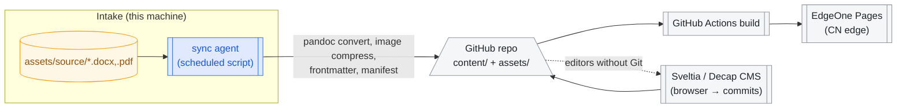

# 空想花庭 Website Plan — Fudan OC Creator Club

> **TL;DR** — Build a bilingual (Chinese-first), light/dark creative site themed on the Arknights
> SideStory *Hortus de Escapismo* (the club's namesake): a monastery garden adrift in the barrens.
> Content lives in Git as Markdown, ships as a static Astro site on Tencent EdgeOne Pages (fast in
> Mainland China), and your machine acts as an offline-first sync agent that converts raw submissions
> into content and pushes them upstream.

## Background — what "Hortus de Escapismo" is

*Hortus de Escapismo* (空想花庭, "Garden of Escapism") is Arknights' 63rd event and a SideStory in
"The Blessed" arc; it opened on the CN server 2023-06-08 and reran 2024-06-25
([moegirl](https://zh.moegirl.org.cn/zh/%E6%98%8E%E6%97%A5%E6%96%B9%E8%88%9F/%E7%A9%BA%E6%83%B3%E8%8A%B1%E5%BA%AD),
[Arknights Terra Wiki](https://arknights.wiki.gg/wiki/Hortus_de_Escapismo)).

### Where the story happens

The story takes place in the **Sanctilaminium Ambrosii (安布罗修修道院)**, a nomadic mobile monastery
that vanished sixty years earlier during the **Profound Silence** (大静谧 — the catastrophe that
shattered Iberia) and suddenly reappeared, stranded in the barrenlands and calling Laterano for help
([event synopsis](https://arknights.wiki.gg/wiki/Hortus_de_Escapismo/Synopsis)).

- **Origins**: the abbey was a joint Laterano–Iberia prestige project — a moving piece of the sacred
  built by two nations, now decaying in no man's land.
- **Laterano (拉特兰)**: Terra's religious heart — a white Holy City with a Pope, whose inhabitants,
  the **Sankta (萨科塔)**, bear halos and light-wings granted by a relic supercomputer ("The Law",
  律法), share an empathic link (共感), and treat firearms as sacrament: holding a gun is "a kind of
  prayer," and shooting kin means falling from grace (堕天)
  ([qq news analysis](https://news.qq.com/rain/a/20250501A07VSV00),
  [lore essay](https://zhuanlan.zhihu.com/p/690064563)).
- **Iberia (伊比利亚)**: the coastal empire broken by the seaborne catastrophe — half of the abbey's
  heritage, present in the story through the Church of the Deep (深海教会) and its bishop Aulus.

### Who lives there

- **Sankta residents** who kept the faith while severed from the Holy City for sixty years.
- **Sarkaz (萨卡兹) refugees and Kazdelian ex-mercenaries** secretly sheltered by the abbot — a grave
  violation of Lateran law, and the story's central wound: paradise that only survives by hiding its
  own people.
- **The gardeners of meaning**: Abbot Stefano Torregrossa; Clément Dubois, an Elafian gardener
  tending flowers in a wasteland; the newly-anointed Saint Federico (Executor) sent to bring the lost
  home; Arturia, whose music stirs long-buried emotion.

### Culture and motifs

- **A garden in the barrens** — "乐园搁浅在不毛之地": paradise shipwrecked on sterile land, yet
  blooming anyway. The flower garden is the abbey's soul and the visual core of the event banner.
- **Faith vs. shelter** — the abbey is "not a paradise, but our shared home" (并非乐土……是我们共同的家园).
- **Pilgrimage and return** — the Saint's mission is to find the lost and "bring them back among us."
- **Manuscript liturgy** — Latin titles, votive language, reliquaries, ink and vellum: the Lateran
  aesthetic is ecclesiastical-modern, white-and-gold order over dust and ruin.

### Why it fits the club

The club's WeChat account name 空想花庭 already claims this metaphor: an OC club *is* an abbey of
imagination — a garden kept alive in unforgiving terrain, sheltering whatever its people create:
novels, characters, worlds. The site's metaphor: **the club is the monastery; every work is a flower
in its garden; every member is a gardener.**

## Design

All theme decisions follow one rule: the site should look like a page from Laterano — sacred order
above, garden wildness within, dusk at the edges.

### Palette

Two modes, one identity. Values are proposals to tune against the event key art.

| Token | Light "Stained-Glass Day" | Dark "Vigil Night" | Role |
|---|---|---|---|
| `--bg` | `#F7F3EA` (vellum ivory) | `#161A26` (deep nave indigo) | page ground |
| `--surface` | `#FFFFFF` | `#1E2334` | cards, panels |
| `--primary` | `#C9A45C` (Lateran gold) | `#E0C07A` (softer gold) | headings, links, rim light |
| `--accent` | `#5F7F59` (garden green) | `#8FB089` | flowers, tags, CTAs |
| `--danger/petal` | `#B2543E` (madder red) | `#CD7A64` | alert, rare emphasis |
| `--ink` | `#2A2620` | `#E8E2D4` | body text |

Implement as CSS custom properties on `data-theme`, flicker-free via an inline script in `<head>`
that reads `localStorage` then `prefers-color-scheme` — the standard pattern, cheap on static pages.

### Typography

- **Chinese display/body**: Noto Serif SC (思源宋体) — the printed-liturgy feel, free and
  CDN-friendly; fallback stack `Songti SC, SimSun, serif` so it degrades gracefully on any machine.
- **Latin display**: Cormorant Garamond or EB Garamond for headings — ecclesiastical, matches
  Noto Serif SC proportions; body Latin inherits the Chinese serif.
- **Metadata/code**: JetBrains Mono or IBM Plex Mono — dates, tags, word counts read like
  catalogue entries on a manuscript card.
- Sizes: fluid type with `clamp()`, oversized display titles (60–80px desktop) — big kinetic
  typography is a defining 2025 portfolio trend
  ([Design Shack](https://designshack.net/articles/trends/portfolio-design/)).

### Icons and graphics

- **Line icons, 1.5px stroke, rounded joins** — Lucide (open source, tree-shakeable) as base set.
- **Custom motifs as inline SVG**: a thin halo-ring as the logo mark and section anchor; a
  flower-with-stem as the "works" glyph; an open chapbook for "activities."
- **Texture**: a very subtle vellum/paper grain (SVG feTurbulence, not a raster image) on `--bg`.

### Layout & components

One grid, two rhythms: sacred structure outside, free growth inside.

- **Landing**: full-bleed hero — the halo-ring logo over a slowly-blooming flower field
  (CSS/Canvas), Latin + Chinese name, one-line motto. Below: three "cloister arches" as entry
  cards (Introduction / Members / Works).
- **Header**: slim manuscript-margin — left logo, right nav + language toggle (中/EN) + theme toggle.
  Frosted-glass on scroll.
- **Cards**: "manuscript cards" — ivory surface, 1px gold hairline border, small-caps metadata row
  (date · author · tags), generous whitespace.
- **Footer**: "cloister walk" — three columns (club intro, contact/WeChat QR, site colophon) over a
  faint engraved-motif strip.

### Motion

All motion native CSS first; JS only where CSS cannot go. Sources below are the current frontier
techniques:

- **Page transitions**: [View Transitions API](https://developer.mozilla.org/en-US/docs/Web/API/View_Transition_API)
  (MPA mode) — gallery items morph into their detail pages, like turning a manuscript page;
  falls back to a plain fade.
- **Scroll choreography**: [CSS scroll-driven animations](https://developer.mozilla.org/en-US/docs/Web/CSS/Guides/Scroll-driven_animations)
  (`animation-timeline: view()`) — cards unroll into view, the hero flower grows as you scroll
  ([pattern reference](https://www.joshwcomeau.com/animation/scroll-driven-animations/)).
- **Ambient layer**: one sporadic petal drift across the hero (Canvas or pure CSS keyframes,
  ≤30 elements) — atmosphere, not a screensaver.
- **Theme switch**: a 400ms circular reveal from the toggle button (View Transitions), as if a lamp
  is lit in the nave.
- Always respect `prefers-reduced-motion`: every animation must have a static fallback.

### i18n

Chinese is the default locale (`zh-CN` content at the root); English lives under `/en/`. In Astro
this is built-in i18n routing with `prefixDefaultLocale: false`. The toggle swaps the current path
between the two trees; untranslated pages fall back to Chinese with a small banner.

## Content

The club already has seed material in this repo (`assets/`): works like《杭城十二时辰》《白银时代》
《你算命了吗》《婺城午夜电台札记》with covers and labels. The IA has four sections.

### Introduction （关于）

- One scrolling page: club name + halo logo, the 空想花庭 quote-as-mission (garden in the barrens),
  three short paragraphs (who we are / what we make / how to join), WeChat QR in the footer card.
- Keep it under 400 Chinese characters per block; the mood carries the page, not the copy.

### Members （修士名录）

- **Grid of "choir stalls"**: each member a card — avatar (their OC or icon), name/codename,
  role tags (写作 / 绘画 / 世界观 / PM), one-line intro, link to their work list.
- Detail page optional: a "profile slip" showing the member's works and OCs pulled from the content
  metadata, so nobody maintains pages by hand.

### Activities （活动志）

- **Chronicle layout**: a vertical timeline of events (workshops, 企划, 合志 publications), each entry
  a manuscript card with date, title, one cover image, two-line summary.
- Ongoing activity gets a gold "in progress" halo-ring badge; past ones sort by year with a sticky
  year rail on the side.

### Works （花庭）— the free-form gallery

The garden page is the centerpiece and must not feel like a filing cabinet.

- **Gallery wall (default)**: a masonry wall (CSS columns) of heterogeneous cards — novel covers,
  paintings, OC sheets — mixed at full bleed, order shuffled lightly by curation date. Each card is
  a "plant": hover lifts it and shows a petal-ring tooltip (title · author · medium).
- **Filter by medium**, not by folder: 文 / 画 / 设定 / 其他 as accent-green chips above the wall.
- **Detail pages by medium**:
  - **Novels**: a "chapbook" reading page — serif double-spacing, section markers as flower
    glyphs, cover on the left rail, chapter list, word count in monospace metadata; source of truth
    is Markdown converted from the docx in `assets/source/`.
  - **OCs / worldbuilding**: Toyhouse-style character sheets ([Toyhouse](https://toyhou.se/) is the
    OC community's canon) — big portrait, attribute table (name/world/relationships), gallery strip
    of related art, cross-links to other members' characters that share a world.
  - **Paintings**: lightbox-first — the wall *is* the content; click opens full-bleed lightbox with
    caption strip, arrow-key navigation, "View Transition" zoom from the thumbnail.
- **Worlds as cross-cutting tags**: a world/企划 name is a tag whose page aggregates every work,
  character, and novel inside that world — this is what makes it a *garden*, not a list.

## Deployment

The hard requirement: free, safe, and reliably reachable from Mainland China, with GitHub as the
source of truth. `*.github.io` is intermittently blocked, so GitHub Pages is the origin at best,
not the front door.

### Recommendation

| Option | Free tier | Mainland reachability | GitHub integration | Verdict |
|---|---|---|---|---|
| **Tencent EdgeOne Pages** | free, incl. functions + KV ([腾讯文档](https://cloud.tencent.com/developer/article/2473972)) | good — Tencent edge network, reported fast in CN tests ([zhihu comparison](https://zhuanlan.zhihu.com/p/674622809), [deployment log](https://www.cnblogs.com/GoldenFingers/p/18567286)) | native, deploys from GitHub repo ([setup guide](https://zhuanlan.zhihu.com/p/8754279703)) | **Primary** |
| Cloudflare Pages | generous free tier | mediocre from CN; improves with a custom domain ([zhihu](https://zhuanlan.zhihu.com/p/674622809)) | native | Fallback / overseas mirror |
| GitHub Pages | free | unstable in Mainland — the stated problem | native | Origin mirror only |
| Vercel / Netlify | free | domains degraded/blocked in CN ([V2EX thread](https://global.v2ex.com/t/1039977)) | native | Skip |
| 帽子云 (maozcloud) | free static hosting, GitHub-Pages-like | CN-optimized ([self-recommendation](https://github.com/ruanyf/weekly/issues/5686)) | yes | Indie dev; keep on radar, don't bet the club on it |

### Setup notes

1. EdgeOne Pages connects the GitHub repo directly. Build command: `npm ci && npm run build`;
   output directory: `dist/`. The site is Astro (static output, no SSR): pages under
   `src/pages/` (zh at root, en under `/en/`), works as a content collection fed by
   `tools/sync_works.mjs` from `assets/label/*.md` (`npm run sync:works` first — build runs it too).
   `designs/` ships under `public/designs/` as the motion lab.
2. Custom domain (optional, ~¥30–60/yr for a `.top`/`.xyz`): point CN users at EdgeOne, or later
   split DNS by region. Without an ICP licence stay on the free `*.edgeone.app`-style subdomain.
3. HTTPS everywhere via the platform's managed certificates; enforce HSTS at the edge.
4. All asset references relative, so the same build serves every mirror unchanged.

## Service

The constraint: delivery is static, but content keeps growing, and the only "backend" is this
Windows machine, online intermittently. The industrial answer is **Git-as-database with an
offline-first sync agent** — the same pattern git-based headless CMSs use
([Jamstack CMS list](https://jamstack.org/headless-cms/),
[git-based CMS comparison](https://statichunt.com/blog/git-based-headless-cms)) — instead of a live server.

(The service loop: raw submissions live on this machine; a scheduled agent converts and pushes them;
CI rebuilds; EdgeOne Pages serves China. Non-technical members can edit through a git-based CMS in
the browser.)

### The sync agent (your machine)

- **What it is**: one Python (or Node) script run by Windows Task Scheduler, e.g. every 6 hours or
  on boot. It is a *store-and-forward* worker: it does its job whenever the network exists and skips
  silently when it doesn't.
- **Pipeline per submission**: scan `assets/source/` → hash each file → skip if unchanged (hashes in
  `manifest.yml`) → the sync hook runs `npm ci && npm run build` (Astro validators +
collection schema catch malformed frontmatter at build time) → commit → `git push`.
- **Idempotent and safe**: the commit is the unit of work; a crash mid-run leaves the tree dirty but
  never the deployed site, because publishing only happens after a CI build of a pushed commit.
- **Provenance**: every work's page gets a "编目于 <date> · source: <filename>" line — the
  abbey-catalogue voice, and a real audit trail.

### Editing for non-Git members

- **[Sveltia CMS](https://github.com/sveltia/sveltia-cms)** (actively maintained Decap successor):
  a static `/admin` page that lets members fill forms for new works, uploaded via GitHub OAuth;
  every save is a commit → CI rebuild. Fits this stack exactly, zero servers
  ([comparison](https://unfoldcms.com/blog/decap-cms-alternatives)).

### Optional dynamics without a server

- **Comments/reactions**: Giscus (GitHub Discussions-backed) — free, no backend.
- **Small state (likes, view counts)**: EdgeOne Pages includes edge functions + KV on the free
  tier ([docs/announcement](https://cloud.tencent.com/developer/article/2473972)) if you want them
  later; keep every dynamic feature an enhancement, never a dependency of reading.

## Next steps

1. Scaffold an Astro site (`zh-CN` default, `/en/` secondary, both themes) and port the four
   sections with the tokens above.
2. Wire the sync agent against the existing `assets/` tree and publish the first version to
   EdgeOne Pages.
3. Add Sveltia CMS once two or three members have real content flowing.
